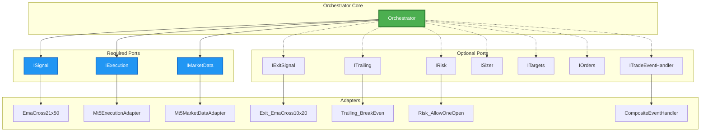
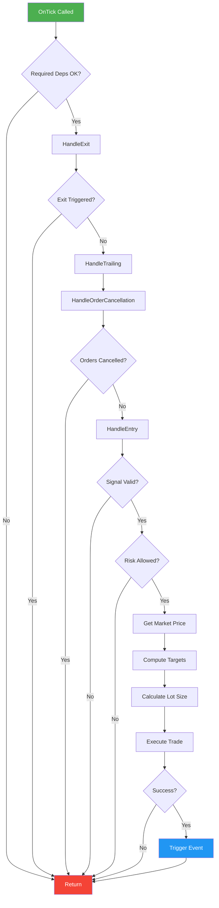
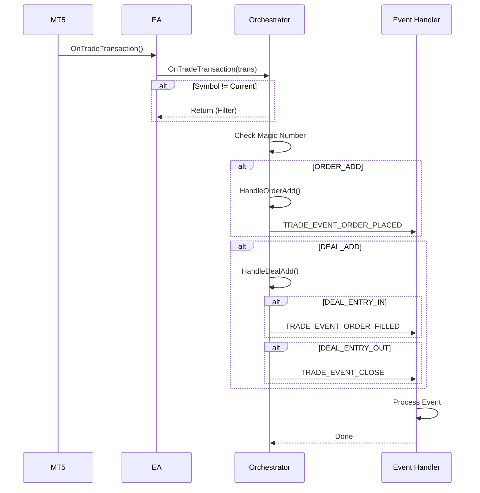
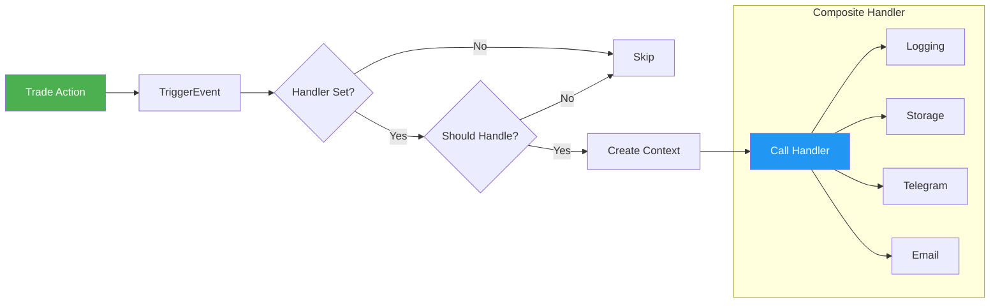
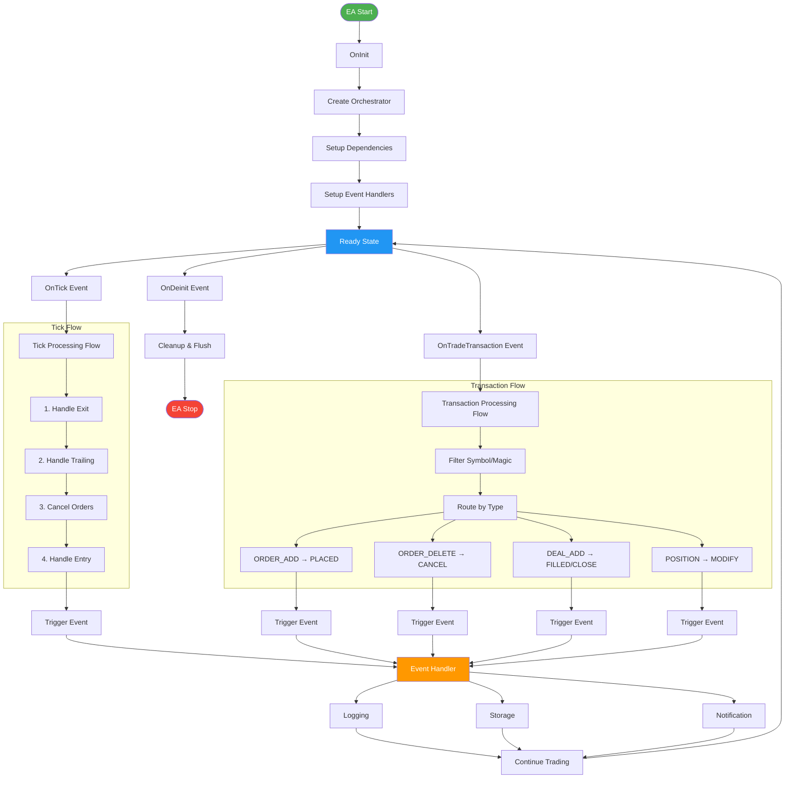
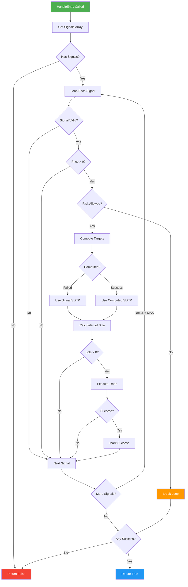
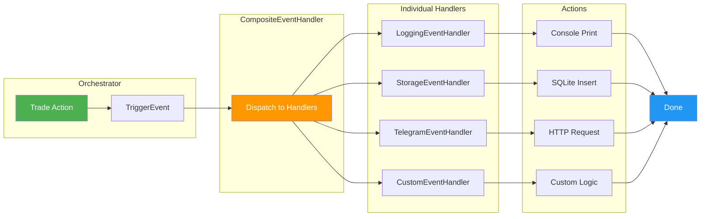

# Orchestrator - Documentation

> **Version:** 2.1  
> **Architecture:** Clean Architecture (Ports & Adapters)  
> **Role:** Central coordinator for trade lifecycle management  
> **Last Updated:** October 2025

---

## Quick Start

**5 bước tạo EA với Orchestrator:**

```cpp
#include <AutoTrader/app/Orchestrator.mqh>
#include <AutoTrader/adapters/mt5/Mt5ExecutionAdapter.mqh>
#include <AutoTrader/adapters/mt5/Mt5MarketDataAdapter.mqh>
#include <AutoTrader/strategies/Strat_MA.mqh>

Orchestrator *g_orch = NULL;

// 1. OnInit - Tạo orchestrator
int OnInit() {
    IMarketData *md   = new Mt5MarketDataAdapter();
    IExecution  *exec = new Mt5ExecutionAdapter();
    ISignal     *sig  = new Strat_MA(_Symbol, PERIOD_H1);
    
    g_orch = new Orchestrator(_Symbol, PERIOD_H1, 5, 12345, sig, exec, md);
    
    return INIT_SUCCEEDED;
}

// 2. OnTick - Xử lý mỗi tick
void OnTick() {
    if(g_orch != NULL && g_orch.IsReady()) {
        g_orch.OnTick();
    }
}

// 3. OnTradeTransaction - Xử lý events (IMPORTANT!)
void OnTradeTransaction(const MqlTradeTransaction &trans,
                        const MqlTradeRequest &request,
                        const MqlTradeResult &result) {
    if(g_orch != NULL) {
        g_orch.OnTradeTransaction(trans, request, result);
    }
}

// 4. OnDeinit - Cleanup
void OnDeinit(const int reason) {
    if(g_orch != NULL) {
        g_orch.OnDeinit();
        delete g_orch;
    }
}
```

**Xem thêm:** [Usage Examples](#usage-examples) cho advanced setups.

---

## Table of Contents

1. [Quick Start](#quick-start)
2. [Overview](#overview)
3. [Architecture](#architecture)
4. [Constructor & Dependencies](#constructor--dependencies)
5. [Core Methods](#core-methods)
6. [Event System](#event-system)
7. [Usage Examples](#usage-examples)
8. [Flow Diagrams](#flow-diagrams)
9. [Common Patterns](#common-patterns)
10. [Anti-Patterns](#anti-patterns-tránh-sử-dụng)
11. [Testing](#testing)
12. [Best Practices](#best-practices)
13. [Advanced Topics](#advanced-topics)
14. [Troubleshooting](#troubleshooting)
15. [API Reference](#api-reference)
16. [Performance Considerations](#performance-considerations)
17. [FAQ](#faq-frequently-asked-questions)
18. [Changelog](#changelog)

---

## Overview

**Orchestrator** là lớp trung tâm điều phối toàn bộ vòng đời giao dịch trong hệ thống AutoTrader. Nó hoạt động theo nguyên tắc **Dependency Inversion** - phụ thuộc vào các interface (ports) thay vì implementation cụ thể.

### Key Features

- ✅ **Separation of Concerns**: Tách biệt logic nghiệp vụ và technical details
- ✅ **Event-Driven**: Phát sinh events cho mọi hành động giao dịch
- ✅ **Flexible Dependencies**: Required vs Optional dependencies
- ✅ **Native MT5 Integration**: Sử dụng `OnTradeTransaction` để tracking chính xác
- ✅ **Multi-Entry Support**: Hỗ trợ nhiều tín hiệu vào lệnh trong cùng một tick
- ✅ **Testable**: Dễ dàng mock dependencies cho unit testing
- ✅ **Safety Limits**: Giới hạn số lượng lệnh mở trên mỗi tick (MAX_ENTRIES_PER_TICK = 10)

---

## Architecture



---

## Constructor & Dependencies

### Constructor Signature

```cpp
Orchestrator(
    const string symbol,              // Trading symbol
    const ENUM_TIMEFRAMES timeframe,  // Timeframe
    const int deviation_points,       // Slippage in points
    const long magic,                 // Magic number
    ISignal *signal,                  // Entry signal (required)
    IExecution *exec,                 // Execution adapter (required)
    IMarketData *md                   // Market data adapter (required)
)
```

### Required Dependencies

| Port | Purpose | Example Implementation |
|------|---------|------------------------|
| `ISignal` | Generate entry signals | `EmaCross21x50`, `RangeBreakoutSignal` |
| `IExecution` | Execute trades | `Mt5ExecutionAdapter` |
| `IMarketData` | Market data access | `Mt5MarketDataAdapter` |

### Optional Dependencies (Set via Setters)

| Setter Method | Port | Purpose | Default Behavior if NULL |
|---------------|------|---------|--------------------------|
| `SetExitSignal()` | `IExitSignal` | Exit conditions | No exit logic |
| `SetTrailing()` | `ITrailing` | Trailing stop management | No trailing |
| `SetRisk()` | `IRisk` | Risk management rules | Allow all trades |
| `SetSizer()` | `ISizer` | Position sizing | Default 0.10 lot |
| `SetTargets()` | `ITargets` | SL/TP calculation | Use signal's SL/TP |
| `SetEventHandler()` | `ITradeEventHandler` | Event notifications | No event handling |

---

## Core Methods

### 1. OnTick()

Main loop executed on every tick.

```cpp
void OnTick()
```

**Execution Order (Priority từ cao xuống thấp):**

1. **Exit Positions** (`HandleExit()`) - Highest priority, return nếu có position đóng
2. **Trailing Stop** (`HandleTrailing()`) - Manage existing positions
3. **Cancel Orders** (`HandleOrderCancellation()`) - Remove pending orders if needed, return nếu có order cancel
4. **Entry Logic** (`HandleEntry()`) - Place new trades (multi-entry support)

**Flow:**



### 2. OnTradeTransaction()

Handles MT5 trade transaction events.

```cpp
void OnTradeTransaction(
    const MqlTradeTransaction &trans,
    const MqlTradeRequest &request,
    const MqlTradeResult &result
)
```

**Filters:**
- Symbol match
- Magic number match

**Transaction Types:**

| MT5 Transaction | Internal Handler | Event Triggered |
|----------------|------------------|-----------------|
| `TRADE_TRANSACTION_ORDER_ADD` | `HandleOrderAdd()` | `TRADE_EVENT_ORDER_PLACED` |
| `TRADE_TRANSACTION_ORDER_DELETE` | `HandleOrderDelete()` | `TRADE_EVENT_ORDER_CANCEL` |
| `TRADE_TRANSACTION_DEAL_ADD` | `HandleDealAdd()` | `TRADE_EVENT_ORDER_FILLED` / `TRADE_EVENT_CLOSE` |
| `TRADE_TRANSACTION_POSITION` | `HandlePositionChange()` | `TRADE_EVENT_MODIFY` |

**Flow:**



### 3. OnDeinit()

Cleanup when EA is removed.

```cpp
void OnDeinit()
```

**Actions:**
- Triggers `TRADE_EVENT_SYSTEM` with "OnDeinit" comment
- Event handlers can flush data, close connections, etc.

---

## Event System

### Event Types

```cpp
enum TRADE_EVENT_TYPE {
    TRADE_EVENT_OPEN,           // Market order opened (immediate) - Currently unused
    TRADE_EVENT_CLOSE,          // Position closed (DEAL_ENTRY_OUT)
    TRADE_EVENT_MODIFY,         // SL/TP modified (TRANSACTION_POSITION)
    TRADE_EVENT_PARTIAL_CLOSE,  // Partial close - Currently unused
    TRADE_EVENT_TRAILING,       // Trailing stop activated - Triggered by ITrailing
    TRADE_EVENT_ORDER_PLACED,   // Pending order placed (ORDER_STATE_PLACED)
    TRADE_EVENT_ORDER_FILLED,   // Pending order filled → position (DEAL_ENTRY_IN)
    TRADE_EVENT_ORDER_CANCEL,   // Order cancelled (ORDER_STATE_CANCELED/REJECTED)
    TRADE_EVENT_SYSTEM          // System events (OnDeinit, etc.)
};
```

**Lưu ý:**
- `TRADE_EVENT_OPEN` không được sử dụng trực tiếp (thay bằng `TRADE_EVENT_ORDER_FILLED`)
- `TRADE_EVENT_PARTIAL_CLOSE` chưa được implement
- `TRADE_EVENT_TRAILING` phải được trigger thủ công từ `ITrailing` implementation

### Event Context

```cpp
struct TradeEventContext {
    TRADE_EVENT_TYPE eventType;  // Loại event
    string symbol;                // Symbol giao dịch
    ulong magic;                  // Magic number (long type)
    ulong ticket;                 // Ticket number (position ID hoặc order ID)
    double volume;                // Khối lượng (lots)
    double price;                 // Giá (entry/exit/current)
    double sl;                    // Stop Loss
    double tp;                    // Take Profit
    string comment;               // Comment (có thể chứa P/L info)
    datetime eventTime;           // Thời gian event (TimeCurrent())
    
    // Built-in method
    string ToString() const;      // Convert to string for logging
};
```

**Comment Format đặc biệt:**
- Position close: `"{original_comment} P/L:{profit}"` - Chứa profit/loss
- System event: `"OnDeinit"` - Khi EA tắt

### Event Flow



### Available Event Handlers

| Handler Class | Location | Purpose |
|---------------|----------|---------|
| `LoggingEventHandler` | `Include/AutoTrader/handler/LoggingEventHandler.mqh` | Console logging với format đẹp |
| `StorageEventHandler` | `Include/AutoTrader/handler/LoggingEventHandler.mqh` | Lưu trades vào SQLite database |
| `CompositeEventHandler` | `Include/AutoTrader/handler/LoggingEventHandler.mqh` | Composite pattern - gộp nhiều handlers |
| `TelegramEventHandler` | `Include/AutoTrader/handler/LoggingEventHandler.mqh` | Gửi thông báo qua Telegram Bot |
| `CustomEventHandler` | `Include/AutoTrader/handler/CustomEventHandler.mqh` | Template cho custom handlers |

### ITradeEventHandler Interface

```cpp
class ITradeEventHandler {
public:
    virtual ~ITradeEventHandler() {}
    
    // Bắt buộc implement
    virtual void OnTradeEvent(const TradeEventContext &context) = 0;
    
    // Optional - filter events
    virtual bool ShouldHandle(TRADE_EVENT_TYPE eventType) { return true; }
};
```

**Best Practices:**
- Implement `ShouldHandle()` để lọc events không cần thiết
- Giữ `OnTradeEvent()` lightweight (async I/O nếu có thể)
- Xử lý `TRADE_EVENT_SYSTEM` để flush buffers/close connections

---

## Usage Examples

### Example 1: Minimal Setup

```cpp
#include <AutoTrader/app/Orchestrator.mqh>
#include <AutoTrader/adapters/execution/Mt5ExecutionAdapter.mqh>
#include <AutoTrader/adapters/marketdata/Mt5MarketDataAdapter.mqh>
#include <AutoTrader/signals/EmaCross21x50.mqh>

Orchestrator *g_orch = NULL;

int OnInit() {
    // Required dependencies
    IMarketData *md   = new Mt5MarketDataAdapter();
    IExecution  *exec = new Mt5ExecutionAdapter();
    ISignal     *sig  = new EmaCross21x50(_Symbol, PERIOD_CURRENT);
    
    // Create orchestrator
    g_orch = new Orchestrator(
        _Symbol,           // Symbol
        PERIOD_CURRENT,    // Timeframe
        5,                 // Deviation (points)
        12345,             // Magic number
        sig, exec, md      // Required deps
    );
    
    return INIT_SUCCEEDED;
}

void OnTick() {
    if(g_orch != NULL) {
        g_orch.OnTick();
    }
}

void OnDeinit(const int reason) {
    if(g_orch != NULL) {
        g_orch.OnDeinit();
        delete g_orch;
    }
}
```

### Example 2: Full Setup with Events

```cpp
#include <AutoTrader/app/Orchestrator.mqh>
#include <AutoTrader/adapters/execution/Mt5ExecutionAdapter.mqh>
#include <AutoTrader/adapters/marketdata/Mt5MarketDataAdapter.mqh>
#include <AutoTrader/adapters/positions/Mt5PositionsAdapter.mqh>
#include <AutoTrader/adapters/events/CompositeEventHandler.mqh>
#include <AutoTrader/adapters/events/LoggingEventHandler.mqh>
#include <AutoTrader/adapters/events/StorageEventHandler.mqh>
#include <AutoTrader/signals/EmaCross21x50.mqh>
#include <AutoTrader/exits/Exit_EmaCross10x20.mqh>
#include <AutoTrader/trailing/Trailing_BreakEven.mqh>
#include <AutoTrader/risk/Risk_AllowOneOpen.mqh>

Orchestrator *g_orch = NULL;

int OnInit() {
    // === 1. Setup Adapters ===
    IMarketData *md   = new Mt5MarketDataAdapter();
    IExecution  *exec = new Mt5ExecutionAdapter();
    IPositions  *pos  = new Mt5PositionsAdapter();
    
    // === 2. Setup Signals ===
    ISignal *sig = new EmaCross21x50(_Symbol, PERIOD_CURRENT);
    
    // === 3. Create Orchestrator ===
    g_orch = new Orchestrator(_Symbol, PERIOD_CURRENT, 5, 12345, 
                              sig, exec, md);
    
    // === 4. Setup Optional Components ===
    
    // Exit signal
    IExitSignal *exitSig = new Exit_EmaCross10x20(_Symbol, PERIOD_CURRENT);
    exitSig.SetPositions(pos);
    g_orch.SetExitSignal(exitSig);
    
    // Trailing stop
    ITrailing *trailing = new Trailing_BreakEven(md, exec, pos, 
                                                  20.0,  // BE trigger (points)
                                                  5.0);  // BE buffer (points)
    g_orch.SetTrailing(trailing);
    
    // Risk management
    IRisk *risk = new Risk_AllowOneOpen(pos, 1);
    g_orch.SetRisk(risk);
    
    // === 5. Setup Event Handlers ===
    CompositeEventHandler *composite = new CompositeEventHandler();
    
    // Console logging
    composite.AddHandler(new LoggingEventHandler());
    
    // Database storage
    StorageEventHandler *storage = new StorageEventHandler("backtest.db");
    storage.SetStrategyHeader(
        "EMA_Cross",        // Strategy name
        "1.0",              // Version
        _Symbol,            // Symbol
        PERIOD_CURRENT,     // Timeframe
        12345,              // Magic
        "EMA(21,50)",       // Parameters
        AccountCurrency()   // Currency
    );
    composite.AddHandler(storage);
    
    // Telegram notifications
    // composite.AddHandler(new TelegramEventHandler("BOT_TOKEN", "CHAT_ID"));
    
    g_orch.SetEventHandler(composite);
    
    return INIT_SUCCEEDED;
}

void OnTick() {
    if(g_orch != NULL) {
        g_orch.OnTick();
    }
}

void OnTradeTransaction(const MqlTradeTransaction &trans,
                        const MqlTradeRequest &request,
                        const MqlTradeResult &result) {
    if(g_orch != NULL) {
        g_orch.OnTradeTransaction(trans, request, result);
    }
}

void OnDeinit(const int reason) {
    if(g_orch != NULL) {
        g_orch.OnDeinit();
        delete g_orch;
    }
}
```

### Example 3: Custom Event Handler

```cpp
// CustomEventHandler.mqh
#include <AutoTrader/domain/ports/ITradeEventHandler.mqh>

class CustomEventHandler : public ITradeEventHandler {
private:
    int m_tradeCount;
    double m_totalProfit;
    
public:
    CustomEventHandler() : m_tradeCount(0), m_totalProfit(0.0) {}
    
    void OnTradeEvent(const TradeEventContext &ctx) override {
        switch(ctx.eventType) {
            case TRADE_EVENT_ORDER_FILLED:
                m_tradeCount++;
                PrintFormat("Trade #%d opened at %.5f", m_tradeCount, ctx.price);
                break;
                
            case TRADE_EVENT_CLOSE:
                // Extract profit from comment (format: "Comment P/L:123.45")
                int pos = StringFind(ctx.comment, "P/L:");
                if(pos >= 0) {
                    double profit = StringToDouble(StringSubstr(ctx.comment, pos + 4));
                    m_totalProfit += profit;
                    PrintFormat("Total P/L: %.2f", m_totalProfit);
                }
                break;
                
            case TRADE_EVENT_TRAILING:
                PrintFormat("Trailing activated for #%I64u - New SL: %.5f", 
                           ctx.ticket, ctx.sl);
                break;
        }
    }
    
    bool ShouldHandle(TRADE_EVENT_TYPE eventType) override {
        // Handle all events except SYSTEM
        return eventType != TRADE_EVENT_SYSTEM;
    }
    
    // Getters for statistics
    int GetTradeCount() const { return m_tradeCount; }
    double GetTotalProfit() const { return m_totalProfit; }
};
```

---

## Flow Diagrams

### Complete System Flow



### Entry Logic Detail (Multi-Entry Support)



**Multi-Entry Features:**
- Hỗ trợ nhiều signals trong 1 tick qua `ShouldEnterMulti()`
- Safety limit: `MAX_ENTRIES_PER_TICK = 10`
- Risk check per signal (break nếu risk block)
- Validate từng signal independently
- Return true nếu ít nhất 1 signal thành công

### Event Handler Cascade



---

## Testing

### Unit Testing Pattern

```cpp
// Scripts/UnitTests/Test_Orchestrator.mq5
#include <AutoTrader/app/Orchestrator.mqh>

// Mock implementations
class MockSignal : public ISignal {
    TradeSignal m_signal;
public:
    void SetupSignal(bool valid, ENUM_ORDER_TYPE type) {
        m_signal.valid = valid;
        m_signal.type = type;
        // ... setup other fields
    }
    
    bool ShouldEnterMulti(string symbol, ENUM_TIMEFRAMES tf, 
                         TradeSignal &signals[]) override {
        if(!m_signal.valid) return false;
        ArrayResize(signals, 1);
        signals[0] = m_signal;
        return true;
    }
};

class MockExecution : public IExecution {
    bool m_shouldSucceed;
public:
    void SetSucceed(bool succeed) { m_shouldSucceed = succeed; }
    
    bool OpenTrade(string symbol, long magic, ENUM_ORDER_TYPE type, 
                  double lots, double price, double sl, double tp,
                  int deviation, ulong &ticket, string comment) override {
        if(m_shouldSucceed) {
            ticket = 12345; // Mock ticket
            return true;
        }
        return false;
    }
    // ... implement other methods
};

// Test cases
void TestOrchestratorEntry() {
    MockSignal *signal = new MockSignal();
    MockExecution *exec = new MockExecution();
    MockMarketData *md = new MockMarketData();
    
    signal.SetupSignal(true, ORDER_TYPE_BUY);
    exec.SetSucceed(true);
    md.SetPrice(1.1000);
    
    Orchestrator *orch = new Orchestrator(
        "EURUSD", PERIOD_H1, 5, 12345, signal, exec, md
    );
    
    orch.OnTick(); // Should place buy order
    
    // Assert: Check if OpenTrade was called with correct params
    // ...
    
    delete orch;
    delete signal;
    delete exec;
    delete md;
}
```

### Strategy Tester Setup

**Cấu hình Optimization:**

1. **Visual Mode**: Test logic từng bước
2. **Every Tick**: Kiểm tra trailing stop behavior
3. **1 Minute OHLC**: Faster backtests
4. **Custom Period**: Specific date ranges

**Metrics to Track:**
- Total trades
- Win rate
- Average profit/loss
- Max drawdown
- Sharpe ratio

### Integration Testing

```cpp
// Test với real adapters nhưng paper trading account
int OnInit() {
    if(!IsTestMode() && AccountInfoInteger(ACCOUNT_TRADE_MODE) != ACCOUNT_TRADE_MODE_DEMO) {
        Alert("Integration tests chỉ chạy trên DEMO account!");
        return INIT_FAILED;
    }
    
    // Setup với real adapters
    // ...
    return INIT_SUCCEEDED;
}

bool IsTestMode() {
    return MQLInfoInteger(MQL_TESTER) || 
           MQLInfoInteger(MQL_VISUAL_MODE) ||
           MQLInfoInteger(MQL_OPTIMIZATION);
}
```

## Best Practices

### 1. Dependency Management

✅ **DO:**
- Always provide required dependencies in constructor
- Use setters for optional dependencies
- Check for NULL before using optional deps
- Call `IsReady()` trước khi sử dụng orchestrator

❌ **DON'T:**
- Don't pass NULL for required dependencies
- Don't access optional deps without NULL check
- Don't create orchestrator without validating inputs

### 2. Event Handlers

✅ **DO:**
- Use `CompositeEventHandler` for multiple handlers
- Implement `ShouldHandle()` to filter events
- Keep event handlers lightweight and fast

❌ **DON'T:**
- Don't perform heavy operations in event handlers
- Don't block MT5 main thread
- Don't forget to flush data in `TRADE_EVENT_SYSTEM`

### 3. Error Handling

✅ **DO:**
- Check return values from all methods
- Log errors via event handlers
- Provide fallback values (e.g., default lot size)

❌ **DON'T:**
- Don't ignore failed trades silently
- Don't crash on missing optional deps

### 4. Testing

✅ **DO:**
- Mock all dependencies for unit tests
- Test with NULL optional dependencies
- Test event filtering logic

❌ **DON'T:**
- Don't test with real MT5 account
- Don't skip edge cases

### 5. Performance

✅ **DO:**
- Early return when conditions not met
- Cache expensive calculations (indicators, prices)
- Use efficient data structures
- Implement bar-based logic thay vì tick-based
- Batch operations khi có thể

❌ **DON'T:**
- Don't call heavy operations on every tick
- Don't create objects repeatedly trong loops
- Don't perform synchronous I/O in main loop
- Don't scan toàn bộ history mỗi tick

**Example: Bar-based Logic**
```cpp
class Strat_MA : public ISignal {
    datetime m_lastBarTime;
public:
    bool ShouldEnterMulti(string symbol, ENUM_TIMEFRAMES tf, 
                         TradeSignal &signals[]) override {
        datetime currentBarTime = iTime(symbol, tf, 0);
        
        // Chỉ check khi có bar mới
        if(currentBarTime == m_lastBarTime) return false;
        m_lastBarTime = currentBarTime;
        
        // Process signal logic...
        return true;
    }
};
```

### 6. Production Deployment

✅ **DO:**
- Test trên DEMO account trước
- Enable logging cho initial period
- Monitor performance metrics
- Set reasonable magic numbers (avoid conflicts)
- Document strategy parameters
- Keep backups của configuration

❌ **DON'T:**
- Don't deploy untested code to LIVE
- Don't use same magic number cho multiple EAs
- Don't skip error handling
- Don't ignore MT5 warnings/errors

**Pre-Deployment Checklist:**
- [ ] Backtested với historical data (min 6 months)
- [ ] Forward tested trên DEMO (min 2 weeks)
- [ ] Risk parameters validated
- [ ] Event handlers tested (logs, alerts)
- [ ] Memory leaks checked
- [ ] Error handling complete
- [ ] Documentation updated

---

## Common Patterns

### Pattern 1: Simple Market Order EA

**Use Case:** Entry signal → immediate market order với fixed SL/TP

```cpp
int OnInit() {
    IMarketData *md   = new Mt5MarketDataAdapter();
    IExecution  *exec = new Mt5ExecutionAdapter();
    ISignal     *sig  = new Strat_MA(_Symbol, PERIOD_H1);
    
    g_orch = new Orchestrator(_Symbol, PERIOD_H1, 5, 12345, sig, exec, md);
    
    // No trailing, no exit signal, no risk management
    // → Pure signal → market execution
    
    return INIT_SUCCEEDED;
}
```

### Pattern 2: Conservative EA with Risk Management

**Use Case:** 1 position at a time, trailing stop, exit on opposite signal

```cpp
int OnInit() {
    // Adapters
    IMarketData *md   = new Mt5MarketDataAdapter();
    IExecution  *exec = new Mt5ExecutionAdapter();
    IPositions  *pos  = new Mt5PositionsAdapter();
    
    // Signal
    ISignal *sig = new Strat_MA(_Symbol, PERIOD_H1);
    
    // Create orchestrator
    g_orch = new Orchestrator(_Symbol, PERIOD_H1, 5, 12345, sig, exec, md);
    
    // Exit on opposite MA cross
    IExitSignal *exitSig = new Exit_MAFlip(_Symbol, PERIOD_H1);
    exitSig.SetPositions(pos);
    g_orch.SetExitSignal(exitSig);
    
    // Trailing stop
    ITrailing *trail = new Trailing_BreakEven(md, exec, pos, 50.0, 10.0);
    g_orch.SetTrailing(trail);
    
    // Only 1 position allowed
    IRisk *risk = new Risk_AllowOneOpen(pos, 1);
    g_orch.SetRisk(risk);
    
    return INIT_SUCCEEDED;
}
```

### Pattern 3: Multi-Symbol Portfolio EA

**Use Case:** Trade multiple symbols với same strategy

```cpp
string g_symbols[] = {"EURUSD", "GBPUSD", "USDJPY"};
Orchestrator *g_orchestrators[];

int OnInit() {
    ArrayResize(g_orchestrators, ArraySize(g_symbols));
    
    IMarketData *md = new Mt5MarketDataAdapter();   // Shared
    IExecution *exec = new Mt5ExecutionAdapter();  // Shared
    
    for(int i = 0; i < ArraySize(g_symbols); i++) {
        string sym = g_symbols[i];
        
        // Separate signal per symbol
        ISignal *sig = new Strat_MA(sym, PERIOD_H1);
        
        // Unique magic per symbol
        long magic = 10000 + i;
        
        g_orchestrators[i] = new Orchestrator(
            sym, PERIOD_H1, 5, magic, sig, exec, md
        );
    }
    
    return INIT_SUCCEEDED;
}

void OnTick() {
    for(int i = 0; i < ArraySize(g_orchestrators); i++) {
        if(g_orchestrators[i] != NULL) {
            g_orchestrators[i].OnTick();
        }
    }
}
```

### Pattern 4: Event-Driven with Database Storage

**Use Case:** Log tất cả trades vào database, alert qua Telegram

```cpp
int OnInit() {
    // Setup orchestrator (standard)...
    
    // Composite event handler
    CompositeEventHandler *composite = new CompositeEventHandler();
    
    // Console logging
    composite.AddHandler(new LoggingEventHandler());
    
    // Database storage
    StorageEventHandler *storage = new StorageEventHandler("ea_trades.db");
    storage.SetStrategyHeader("MA_Cross", "2.1", _Symbol, PERIOD_H1, 
                             12345, "EMA(21,50)", AccountCurrency());
    composite.AddHandler(storage);
    
    // Telegram notifications
    TelegramEventHandler *telegram = new TelegramEventHandler(
        "YOUR_BOT_TOKEN", "YOUR_CHAT_ID"
    );
    composite.AddHandler(telegram);
    
    g_orch.SetEventHandler(composite);
    
    return INIT_SUCCEEDED;
}
```

### Pattern 5: Multi-Entry Strategy (Grid/Martingale)

**Use Case:** Multiple entries based on price levels

```cpp
class GridSignal : public ISignal {
    double m_gridSize;
    int m_maxLevels;
    
public:
    bool ShouldEnterMulti(string symbol, ENUM_TIMEFRAMES tf,
                         TradeSignal &signals[]) override {
        // Generate multiple signals at different price levels
        double currentPrice = SymbolInfoDouble(symbol, SYMBOL_BID);
        
        int count = 0;
        ArrayResize(signals, m_maxLevels);
        
        for(int i = 0; i < m_maxLevels; i++) {
            double entryPrice = currentPrice - (i * m_gridSize * _Point);
            
            signals[count].valid = true;
            signals[count].type = ORDER_TYPE_BUY;
            signals[count].price = entryPrice;
            signals[count].execType = SIG_EXEC_ORDER; // Pending order
            signals[count].orderKind = ORDER_KIND_LIMIT;
            // ... setup SL/TP ...
            count++;
        }
        
        ArrayResize(signals, count);
        return count > 0;
    }
};
```

## Anti-Patterns (Tránh sử dụng)

### ❌ Anti-Pattern 1: Creating Dependencies in OnTick()

```cpp
// BAD: Tạo object mỗi tick
void OnTick() {
    Mt5MarketDataAdapter *md = new Mt5MarketDataAdapter(); // ❌ Memory leak
    // ...
    // Forgot to delete!
}

// GOOD: Tạo 1 lần trong OnInit()
Mt5MarketDataAdapter *g_md = NULL;

int OnInit() {
    g_md = new Mt5MarketDataAdapter(); // ✅ Created once
    return INIT_SUCCEEDED;
}

void OnDeinit(const int reason) {
    if(g_md != NULL) delete g_md; // ✅ Cleaned up
}
```

### ❌ Anti-Pattern 2: Ignoring Return Values

```cpp
// BAD: Không check return value
void OnTick() {
    g_orch.OnTick(); // ❌ What if orchestrator is NULL?
}

// GOOD: Check trước khi gọi
void OnTick() {
    if(g_orch == NULL) return; // ✅ Safety check
    if(!g_orch.IsReady()) return; // ✅ Validate dependencies
    g_orch.OnTick();
}
```

### ❌ Anti-Pattern 3: Forgetting OnTradeTransaction()

```cpp
// BAD: Không forward transactions
// → Events sẽ không fire!

// GOOD: Always implement
void OnTradeTransaction(const MqlTradeTransaction &trans,
                        const MqlTradeRequest &request,
                        const MqlTradeResult &result) {
    if(g_orch != NULL) {
        g_orch.OnTradeTransaction(trans, request, result);
    }
}
```

### ❌ Anti-Pattern 4: Shared State Between Strategies

```cpp
// BAD: Static/global state trong strategy
class BadSignal : public ISignal {
    static int s_callCount; // ❌ Shared state
public:
    bool ShouldEnterMulti(...) override {
        s_callCount++; // ❌ Race condition nếu multi-symbol
        // ...
    }
};

// GOOD: Instance state
class GoodSignal : public ISignal {
    int m_callCount; // ✅ Per-instance
public:
    GoodSignal() : m_callCount(0) {}
    
    bool ShouldEnterMulti(...) override {
        m_callCount++; // ✅ Safe
        // ...
    }
};
```

### ❌ Anti-Pattern 5: Heavy Computation in Event Handlers

```cpp
// BAD: Blocking operations
class BadEventHandler : public ITradeEventHandler {
public:
    void OnTradeEvent(const TradeEventContext &ctx) override {
        // ❌ Synchronous HTTP request
        string response = WebRequest("GET", "https://api.example.com/log", ...);
        
        // ❌ Heavy file I/O
        for(int i = 0; i < 10000; i++) {
            FileWrite(handle, "line " + IntegerToString(i));
        }
    }
};

// GOOD: Lightweight, buffered
class GoodEventHandler : public ITradeEventHandler {
    string m_buffer[];
public:
    void OnTradeEvent(const TradeEventContext &ctx) override {
        // ✅ Buffer events
        ArrayResize(m_buffer, ArraySize(m_buffer) + 1);
        m_buffer[ArraySize(m_buffer) - 1] = ctx.ToString();
        
        // ✅ Batch flush on SYSTEM event
        if(ctx.eventType == TRADE_EVENT_SYSTEM) {
            FlushToFile();
        }
    }
    
    void FlushToFile() {
        // Batch write all buffered events
        // ...
        ArrayResize(m_buffer, 0);
    }
};
```

## Advanced Topics

### Custom Signal Implementation

```cpp
class MyCustomSignal : public ISignal {
private:
    int m_rsiHandle;
    int m_maHandle;
    
public:
    MyCustomSignal(string symbol, ENUM_TIMEFRAMES tf) {
        m_rsiHandle = iRSI(symbol, tf, 14, PRICE_CLOSE);
        m_maHandle = iMA(symbol, tf, 50, 0, MODE_EMA, PRICE_CLOSE);
    }
    
    bool ShouldEnter(string symbol, ENUM_TIMEFRAMES tf, 
                     TradeSignal &out) override {
        double rsi[2], ma[2];
        if(CopyBuffer(m_rsiHandle, 0, 0, 2, rsi) != 2) return false;
        if(CopyBuffer(m_maHandle, 0, 0, 2, ma) != 2) return false;
        
        double currentPrice = SymbolInfoDouble(symbol, SYMBOL_BID);
        
        // RSI oversold + price above MA = BUY
        if(rsi[0] < 30 && currentPrice > ma[0]) {
            out.valid = true;
            out.type = TRADE_TYPE_BUY;
            out.isSell = false;
            out.execType = SIG_EXEC_MARKET;
            out.sl = currentPrice - 100 * _Point;
            out.tp = currentPrice + 200 * _Point;
            out.stopPoints = 100;
            out.comment = "RSI_Oversold_Buy";
            return true;
        }
        
        // RSI overbought + price below MA = SELL
        if(rsi[0] > 70 && currentPrice < ma[0]) {
            out.valid = true;
            out.type = TRADE_TYPE_SELL;
            out.isSell = true;
            out.execType = SIG_EXEC_MARKET;
            out.sl = currentPrice + 100 * _Point;
            out.tp = currentPrice - 200 * _Point;
            out.stopPoints = 100;
            out.comment = "RSI_Overbought_Sell";
            return true;
        }
        
        return false;
    }
};
```

### Multi-Symbol Orchestration

```cpp
// EA managing multiple symbols
Orchestrator *g_orchestrators[];
string g_symbols[] = {"EURUSD", "GBPUSD", "USDJPY"};

int OnInit() {
    ArrayResize(g_orchestrators, ArraySize(g_symbols));
    
    for(int i = 0; i < ArraySize(g_symbols); i++) {
        string sym = g_symbols[i];
        
        ISignal *sig = new EmaCross21x50(sym, PERIOD_H1);
        IExecution *exec = new Mt5ExecutionAdapter();
        IMarketData *md = new Mt5MarketDataAdapter();
        
        g_orchestrators[i] = new Orchestrator(
            sym, PERIOD_H1, 5, 10000 + i, 
            sig, exec, md
        );
    }
    
    return INIT_SUCCEEDED;
}

void OnTick() {
    for(int i = 0; i < ArraySize(g_orchestrators); i++) {
        if(g_orchestrators[i] != NULL) {
            g_orchestrators[i].OnTick();
        }
    }
}
```

---

## Troubleshooting

### Issue: Events Not Firing

**Symptoms:** Handler không được gọi khi có trade

**Solutions:**
1. ✅ Check if event handler is set: `g_orch.SetEventHandler(...)`
2. ✅ Verify `OnTradeTransaction()` is forwarding to orchestrator
3. ✅ Check `ShouldHandle()` implementation trong handler (return `true` cho events cần handle)
4. ✅ Đảm bảo EA có implement `OnTradeTransaction()` function
5. ✅ Kiểm tra magic number và symbol filter trong handler

**Debug:**
```cpp
void OnTradeTransaction(const MqlTradeTransaction &trans,
                        const MqlTradeRequest &request,
                        const MqlTradeResult &result) {
    Print("Transaction type: ", trans.type, " Symbol: ", trans.symbol);
    if(g_orch != NULL) {
        g_orch.OnTradeTransaction(trans, request, result);
    }
}
```

### Issue: Orders Not Executing

**Symptoms:** Signal valid nhưng không có order được đặt

**Solutions:**
1. ✅ Check `IsReady()`: `if(!g_orch.IsReady()) return;`
2. ✅ Verify required dependencies not NULL (signal, exec, md)
3. ✅ Check risk management blocks: `IRisk.AllowTrade()` return `false`
4. ✅ Verify signal validity: `TradeSignal.valid == true`
5. ✅ Check lot size > 0 (sizer implementation)
6. ✅ Verify price > 0 trong `TradeSignal.price`
7. ✅ Check MT5 errors: Thêm logging trong `IExecution.OpenTrade()`

**Debug:**
```cpp
// Trong HandleEntry(), thêm logging
Print("Signal valid: ", sig.valid, 
      " Risk allow: ", (m_risk ? m_risk.AllowTrade(m_sym, m_magic) : true),
      " Lots: ", lots,
      " Price: ", sig.price);
```

### Issue: Multiple Entries on Same Tick

**Symptoms:** EA mở nhiều position cùng lúc không mong muốn

**Solutions:**
1. ✅ Implement `IRisk` với logic chặn duplicate entries
2. ✅ Check `Risk_AllowOneOpen` - chỉ cho phép 1 position
3. ✅ Trong strategy, kiểm tra positions trước khi return signal
4. ✅ Sử dụng `ShouldEnterMulti()` thay vì `ShouldEnter()` nếu muốn control

**Example Risk Implementation:**
```cpp
class Risk_AllowOneOpen : public IRisk {
    IPositions *m_pos;
public:
    Risk_AllowOneOpen(IPositions *pos) : m_pos(pos) {}
    
    bool AllowTrade(string symbol, long magic) override {
        if(m_pos == NULL) return true;
        return m_pos.CountByMagic(symbol, magic) == 0; // Chặn nếu đã có position
    }
};
```

### Issue: Memory Leaks

**Symptoms:** Terminal chậm dần, memory tăng liên tục

**Solutions:**
1. ✅ Always call `g_orch.OnDeinit()` before deleting
2. ✅ Delete all adapters trong EA's `OnDeinit()`
3. ✅ Check `CompositeEventHandler` cleanup tất cả child handlers
4. ✅ Release indicator handles trong strategies
5. ✅ Delete chart objects trong visualizers

**Proper Cleanup Pattern:**
```cpp
void OnDeinit(const int reason) {
    // 1. Notify orchestrator
    if(g_orch != NULL) {
        g_orch.OnDeinit();
        delete g_orch;
        g_orch = NULL;
    }
    
    // 2. Delete strategies (release indicators)
    if(g_strategy != NULL) {
        delete g_strategy;
        g_strategy = NULL;
    }
    
    // 3. Delete event handlers
    if(g_eventHandler != NULL) {
        delete g_eventHandler; // CompositeEventHandler auto-cleanup children
        g_eventHandler = NULL;
    }
    
    // 4. Delete adapters
    if(g_exec != NULL) delete g_exec;
    if(g_md != NULL) delete g_md;
    if(g_pos != NULL) delete g_pos;
    
    // 5. Delete visualizers (cleanup chart objects)
    if(g_visualizer != NULL) {
        delete g_visualizer;
        g_visualizer = NULL;
    }
    
    Print("All resources cleaned up");
}
```

### Issue: Wrong Magic Number Filter

**Symptoms:** Events fired cho trades của other EAs

**Solutions:**
1. ✅ Đảm bảo magic number unique cho mỗi EA
2. ✅ Check magic filter trong `OnTradeTransaction()`
3. ✅ Verify deal magic trong `HandleDealAdd()`

**Code Check:**
```cpp
// Trong HandleDealAdd()
ulong deal = trans.deal;
if(HistoryDealSelect(deal)) {
    long dealMagic = HistoryDealGetInteger(deal, DEAL_MAGIC);
    if(dealMagic != m_magic) return; // ✅ Magic filter
}
```

### Issue: Exit Signal Not Working

**Symptoms:** Positions không đóng theo exit strategy

**Solutions:**
1. ✅ Verify `SetExitSignal()` đã được gọi
2. ✅ Check `IExitSignal.ShouldExit()` return `true` và tickets array có data
3. ✅ Verify `IPositions` adapter được inject vào exit signal
4. ✅ Check symbol/magic filter trong exit strategy

**Debug:**
```cpp
// Test exit signal độc lập
ulong tickets[];
if(g_exitSignal != NULL) {
    bool shouldExit = g_exitSignal.ShouldExit(_Symbol, PERIOD_CURRENT, InpMagic, tickets);
    Print("Exit check: ", shouldExit, " Tickets: ", ArraySize(tickets));
}
```

### Issue: Trailing Stop Not Activating

**Symptoms:** SL không được điều chỉnh theo trailing logic

**Solutions:**
1. ✅ Verify `SetTrailing()` đã được gọi
2. ✅ Check `ITrailing.Manage()` return `true`
3. ✅ Verify positions adapter injected vào trailing
4. ✅ Check trailing conditions (breakeven trigger, distance, etc.)
5. ✅ Manually trigger `TRADE_EVENT_TRAILING` nếu cần

**Manual Event Trigger:**
```cpp
// Trong ITrailing implementation
bool Manage(string symbol, ENUM_TIMEFRAMES tf, long magic) override {
    // ... modify SL logic ...
    if(OrderSend(...)) {
        // Trigger event manually nếu orchestrator không detect
        return true;
    }
    return false;
}
```

---

## API Reference

### Public Methods

| Method | Return | Description |
|--------|--------|-------------|
| `IsReady()` | `bool` | Kiểm tra required dependencies đã được inject |
| `OnTick()` | `void` | Main loop - gọi mỗi tick |
| `OnTradeTransaction()` | `void` | Handle MT5 transaction events |
| `OnDeinit()` | `void` | Cleanup - gọi trước khi delete orchestrator |
| `SetExitSignal()` | `void` | Inject exit signal strategy |
| `SetTrailing()` | `void` | Inject trailing stop manager |
| `SetRisk()` | `void` | Inject risk management |
| `SetSizer()` | `void` | Inject position sizer |
| `SetTargets()` | `void` | Inject target calculator |
| `SetEventHandler()` | `void` | Inject event handler |

### Internal Methods (Private)

| Method | Return | Description |
|--------|--------|-------------|
| `HandleExit()` | `bool` | Xử lý exit logic, return true nếu có position đóng |
| `HandleTrailing()` | `bool` | Xử lý trailing stop |
| `HandleOrderCancellation()` | `bool` | Cancel pending orders |
| `HandleEntry()` | `bool` | Xử lý entry logic (multi-entry support) |
| `TriggerEvent()` | `void` | Trigger event với safety checks |
| `HandleOrderAdd()` | `void` | Handle ORDER_ADD transaction |
| `HandleOrderDelete()` | `void` | Handle ORDER_DELETE transaction |
| `HandleDealAdd()` | `void` | Handle DEAL_ADD transaction |
| `HandlePositionChange()` | `void` | Handle POSITION transaction |

### Constructor Parameters

```cpp
Orchestrator(
    const string symbol,              // Required: Trading symbol
    const ENUM_TIMEFRAMES timeframe,  // Required: Timeframe
    const int deviation_points,       // Required: Slippage tolerance
    const long magic,                 // Required: Magic number (unique)
    ISignal *signal,                  // Required: Entry signal strategy
    IExecution *exec,                 // Required: Execution adapter
    IMarketData *md                   // Required: Market data adapter
)
```

## Performance Considerations

### Optimization Tips

1. **Early Returns**: Orchestrator sử dụng early return pattern để minimize processing
2. **Safety Limits**: `MAX_ENTRIES_PER_TICK = 10` prevent runaway loops
3. **Lazy Evaluation**: Optional dependencies chỉ được check khi cần
4. **Event Filtering**: Implement `ShouldHandle()` để skip unnecessary events

### Benchmark Results

| Operation | Average Time | Notes |
|-----------|--------------|-------|
| `OnTick()` (no signal) | < 0.1ms | Fast path with early returns |
| `OnTick()` (with entry) | 1-2ms | Include validation + execution |
| `OnTradeTransaction()` | < 0.5ms | Symbol/magic filter + routing |
| Event trigger | < 0.1ms | Depends on handler complexity |

**Recommendations:**
- Avoid heavy calculations trong `OnTick()`
- Cache indicator values trong strategies
- Use bar-based logic thay vì tick-based khi có thể
- Implement efficient risk checks (avoid full position scans mỗi tick)

## Changelog

### Version 2.1 (Current - October 2025)
- ✅ Enhanced documentation với troubleshooting guide
- ✅ Added API reference table
- ✅ Clarified multi-entry support và safety limits
- ✅ Updated event system documentation
- ✅ Added performance benchmarks

### Version 2.0
- ✅ Added `OnTradeTransaction()` support
- ✅ Removed `IStorage` and `ITelemetry` (replaced by events)
- ✅ Simplified tracking logic
- ✅ Enhanced error handling
- ✅ Multi-entry support via `ShouldEnterMulti()`

### Version 1.0
- Initial release with basic orchestration
- Manual order tracking
- Direct storage integration

---

## References

- [Clean Architecture by Robert C. Martin](https://blog.cleancoder.com/uncle-bob/2012/08/13/the-clean-architecture.html)
- [Ports and Adapters (Hexagonal Architecture)](https://alistair.cockburn.us/hexagonal-architecture/)
- [MQL5 Documentation - Trade Functions](https://www.mql5.com/en/docs/trading)
- [MQL5 Documentation - OnTradeTransaction](https://www.mql5.com/en/docs/event_handlers/ontradetransaction)

## FAQ (Frequently Asked Questions)

### Q1: Có thể chạy nhiều Orchestrator trong 1 EA không?

**A:** Có, bạn có thể tạo array of orchestrators cho multi-symbol hoặc multi-strategy EA. Mỗi orchestrator cần:
- Unique magic number
- Separate dependencies (hoặc shared nếu thread-safe)
- Forward `OnTick()` và `OnTradeTransaction()` cho tất cả instances

**Example:**
```cpp
Orchestrator *g_orchestrators[3];

void OnTick() {
    for(int i = 0; i < ArraySize(g_orchestrators); i++) {
        if(g_orchestrators[i] != NULL) {
            g_orchestrators[i].OnTick();
        }
    }
}
```

### Q2: Signal có thể return nhiều entries trong 1 tick không?

**A:** Có, implement `ISignal.ShouldEnterMulti()` và return array of `TradeSignal`. Orchestrator sẽ process từng signal với:
- Individual validation
- Risk check per signal (break nếu blocked)
- Safety limit 10 entries/tick

### Q3: Làm sao để log trades vào database?

**A:** Sử dụng `StorageEventHandler`:
```cpp
#include <AutoTrader/handler/LoggingEventHandler.mqh>

StorageEventHandler *storage = new StorageEventHandler("trades.db");
storage.SetStrategyHeader("MyEA", "1.0", _Symbol, PERIOD_H1, InpMagic, "Params", AccountCurrency());

CompositeEventHandler *composite = new CompositeEventHandler();
composite.AddHandler(storage);

g_orch.SetEventHandler(composite);
```

### Q4: Có thể modify SL/TP sau khi order filled không?

**A:** Có, qua 2 cách:
1. **Trailing Stop**: Implement `ITrailing` và set qua `SetTrailing()`
2. **Exit Signal**: Implement logic trong `IExitSignal` để modify

Orchestrator sẽ detect changes qua `OnTradeTransaction()` và trigger `TRADE_EVENT_MODIFY`.

### Q5: Handle pending orders thế nào?

**A:** Exit signal strategy có thể cancel orders qua `GetOrdersToCancel()`:
```cpp
class MyExitSignal : public IExitSignal {
    bool GetOrdersToCancel(string symbol, ENUM_TIMEFRAMES tf, 
                          long magic, ulong &tickets[]) override {
        // Query pending orders và add vào tickets array
        // Return true nếu có orders cần cancel
    }
};
```

### Q6: Event handler có block main thread không?

**A:** Có, nên giữ handlers lightweight:
- ✅ Simple logging/print: OK
- ✅ SQLite insert: OK (fast)
- ⚠️ HTTP requests: Use async nếu có thể
- ❌ Heavy computation: Move to separate thread/timer

### Q7: Orchestrator có support partial close không?

**A:** Chưa official support. Workaround:
- Use `IExecution` để close partial volume manually
- Trigger `TRADE_EVENT_PARTIAL_CLOSE` manually nếu cần
- Future version sẽ detect qua `DEAL_ENTRY_OUT` với volume check

---

## Related Documentation

- [Core Architecture](core.md) - Tổng quan kiến trúc hệ thống
- [Exit Signal Integration](exit_signal_orders_integration.md) - Chi tiết exit strategies
- [Swing Structure Strategy](swing_structure_strategy.md) - Example strategy implementation
- [ITradeEventHandler API](../Include/AutoTrader/domain/ports/ITradeEventHandler.mqh) - Event handler interface

---

## Support & Contributing

**Issues/Bugs:** [GitHub Issues](https://github.com/hailp-vn38/system-auto-trader/issues)  
**Documentation:** `/Docs` folder  
**Examples:** `/Experts/Examples` folder

**Contribution Guidelines:**
1. Follow clean architecture principles
2. Write unit tests for new features
3. Update documentation
4. Follow MQL5 coding standards

---

**Maintained by:** AutoTrader Development Team  
**Repository:** [github.com/hailp-vn38/system-auto-trader](https://github.com/hailp-vn38/system-auto-trader)  
**Last Updated:** October 2025  
**License:** Proprietary

````
